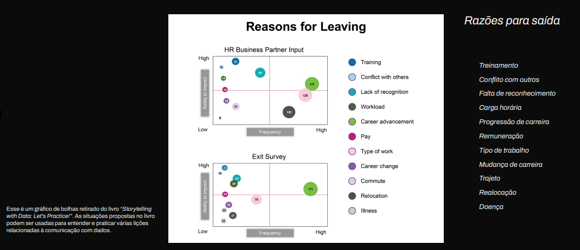
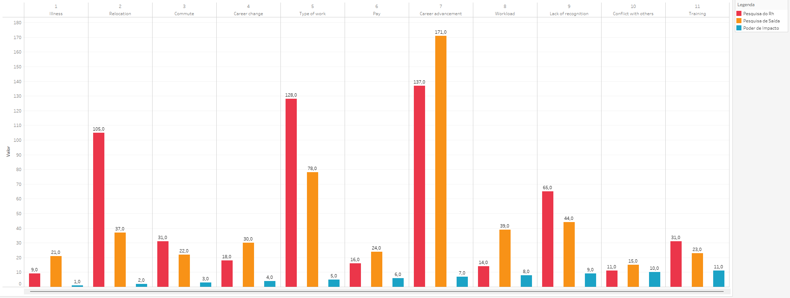
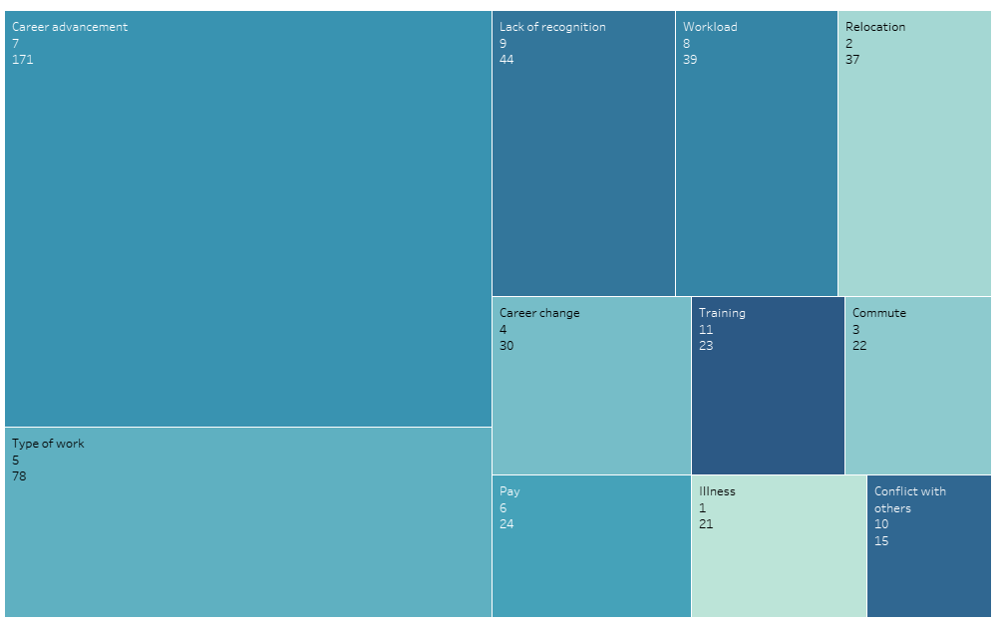
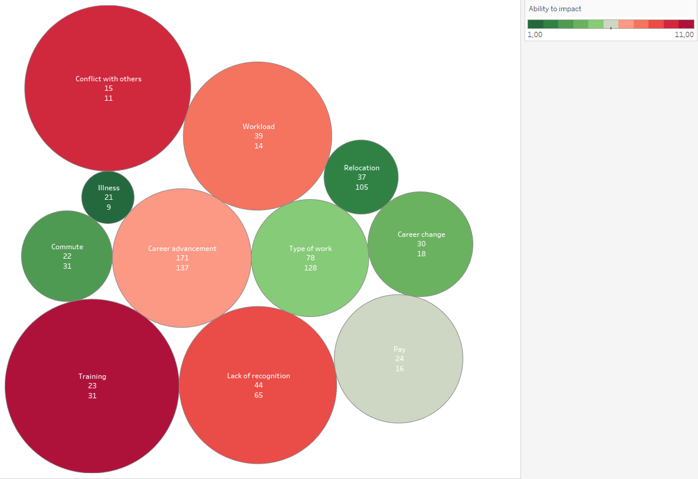
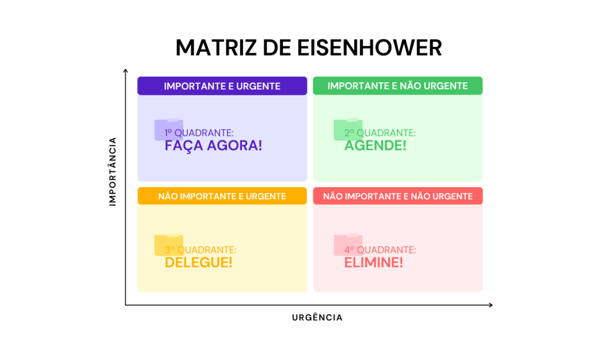

# Análise de Atrito na Organização de Marketing: Entendendo as Causas e Tendências

## Introdução

Bem-vindo ao relatório de análise de atrito na organização de marketing. Neste projeto, realizamos uma investigação detalhada sobre os fatores que têm levado à saída de funcionários em toda a nossa equipe de marketing.

A retenção de talentos é de suma importância para o sucesso e crescimento de qualquer organização, e nosso foco aqui é entender as causas subjacentes ao atrito e apresentar insights valiosos que possam informar estratégias eficazes de retenção de pessoal.

Sob a orientação do Chief Marketing Officer (CMO), colaboramos estreitamente com nossos Parceiros de Negócios de Recursos Humanos (HRBP) para coletar e analisar dados relevantes. Neste relatório, você encontrará um resumo das descobertas e observações cruciais derivadas da análise, destacando padrões e tendências que podem estar contribuindo para a saída de funcionários em nossa equipe de marketing.

Nossa abordagem envolveu uma análise minuciosa de dados quantitativos e qualitativos, incluindo pesquisas realizadas pelo setor de Recursos Humanos (RH) e pesquisas anônimas de saída. Ao longo deste relatório, examinaremos como diferentes motivos de saída são percebidos pelos funcionários e como esses motivos se relacionam com a decisão efetiva de deixar a empresa.

Este relatório busca fornecer insights acionáveis que possam guiar estratégias de retenção de talentos, melhorar a satisfação dos funcionários e fortalecer o ambiente de trabalho em toda a organização de marketing. Estamos confiantes de que esses insights serão um passo significativo na direção certa para abordar os desafios de atrito e promover um ambiente saudável e produtivo para nossa equipe.

Vamos mergulhar nas descobertas e analisar as observações detalhadamente para obter uma compreensão completa das causas subjacentes ao atrito em nossa organização de marketing. Juntos, podemos formular estratégias eficazes para manter e nutrir nosso talento e alcançar nossos objetivos de crescimento de maneira sustentável.

# Análise de Atrito na Organização de Marketing: Entendendo as Causas e Tendências

  

Esses gráficos retratam a relação entre a frequência com que diferentes motivos de saída dos funcionários são mencionados e o impacto percebido desses motivos na decisão efetiva de deixar a empresa. No eixo horizontal (eixo X), temos a frequência de citação de cada motivo, com os valores organizados de forma crescente da esquerda para a direita, variando do "baixo" ao "alto" (ou "mínimo" ao "máximo").

Observando os gráficos, percebemos que um deles representa os resultados de uma pesquisa realizada pelo setor de Recursos Humanos (RH), enquanto o outro reflete os resultados de uma pesquisa de saída, presumivelmente conduzida de forma anônima antes que os funcionários efetivamente deixassem a empresa. Embora as proporções sejam semelhantes entre os dois gráficos, notamos uma notável mudança nos padrões de respostas.

Especificamente, o gráfico da pesquisa de saída demonstra um aumento significativo em questões sensíveis, como "Progressão de carreira", "Mudança de carreira" e "Carga horária". Esses tópicos têm menos registros na pesquisa do RH. Essa discrepância sugere uma falta de confiança por parte dos funcionários na empresa, uma vez que tópicos mais delicados estão sendo mais frequentemente mencionados na pesquisa anônima de saída.

## Considerações sobre a Visualização

A visualização atual do gráfico apresenta algumas limitações que podem impactar a interpretação precisa da relação entre frequência e impacto. Aqui estão algumas áreas que poderiam ser melhoradas:

1. **Equilíbrio Visual Enganador**: A disposição dos registros afastados do ponto inicial do gráfico pode criar uma impressão errônea da relação entre frequência e impacto. Apesar da distância, o motivo que mais frequentemente leva à saída efetiva está mais próximo do centro do gráfico. Isso pode gerar confusão ou passar despercebido por observadores sem conhecimento detalhado do conteúdo.

2. **Contexto da Amostra**: Não temos informações sobre o tamanho da amostra utilizada para coletar os dados. Saber quantas pessoas foram entrevistadas ajudaria a entender a representatividade dos resultados e a generalização para toda a população de funcionários.

3. **Ordenação e Repetição dos Motivos**: Não fica claro se cada entrevistado classificou todos os motivos em ordem de importância ou se apenas escolheu um motivo principal. A ausência desse contexto pode influenciar a interpretação, já que a ordenação individual dos motivos pode variar.

4. **Falha em Identificar Características-Chave**: Não há identificação visual clara das características-chave, como os motivos específicos de saída. Isso dificulta a compreensão imediata do que cada ponto no gráfico representa.

5. **Falta de Títulos e Legendas Descritivos**: A visualização não possui títulos e legendas claros, o que poderia fornecer orientações sobre o que está sendo retratado, os eixos e a interpretação correta das cores ou padrões.

Alguns feedbacks e sugestões:

1. **Como você pode destacar o motivo de saída mais relevante?**: Explorar diferentes formas de destacar visualmente o motivo com maior impacto poderia ajudar os observadores a compreender sua importância de forma mais intuitiva.

2. **Poderia fornecer informações sobre a amostra?**: Incluir detalhes sobre o tamanho da amostra, a representatividade dos respondentes e o método de coleta dos dados contribuiria para uma interpretação mais precisa.

3. **Explicação da Ordenação e Escolha dos Motivos**: Se os entrevistados ordenaram todos os motivos ou apenas escolheram o motivo principal, esclarecer essa abordagem ajudaria a contextualizar as respostas.

4. **Adicione Títulos Descritivos e Legendas**: Introduzir um título informativo e legendas para os eixos, bem como para os pontos no gráfico, poderia tornar a visualização mais acessível e compreensível.

5. **Considere um Formato Alternativo**: Avaliar se outro formato de gráfico, como um gráfico de barras ou um gráfico de dispersão, poderia representar os dados de maneira mais clara e eficaz.

## Alternativas para visualização dos dados.

## Gráfico de Barras Agrupado

  

O uso do Gráfico de Barras Agrupado é uma abordagem eficaz para comparar a frequência de cada motivo de saída nas três categorias diferentes: "Ability to impact", "HRBP" e "Exit survey". Cada motivo é representado por uma barra, e essas barras são agrupadas de acordo com as categorias. Essa escolha é fundamentada por diversas razões:

### Comparação Facilitada: O gráfico de barras agrupado é especialmente útil para comparar a frequência dos motivos de saída em diferentes categorias. Com um único olhar, é possível identificar quais motivos têm maior ou menor frequência em cada categoria.

### Destaque de Diferenças: A disposição das barras lado a lado destaca as diferenças de frequência entre as categorias, permitindo uma análise rápida e intuitiva das variações nos motivos de saída.

### Facilidade de Leitura: A representação visual das barras torna a interpretação acessível, mesmo para aqueles que não têm familiaridade com análises detalhadas. As cores podem ser usadas para distinguir cada motivo de saída nas diferentes categorias.

## Gráfico de Árvore

  

O uso do Gráfico de Árvore nos ajuda a entender melhor a quantidade de registros de uma tabela,nesse caso o gráfico de "EXIT SURVEY", porém não temos a correlação com os dados do "HRBP",sendo necessário gerar outra visualização para fazer essa comparação.

## Gráfico de Bolhas (Bubble Chart)

  

A opção pelo Gráfico de Bolhas nos dá uma visualização dos dados através de bolhas onde o tamanho das bolhas são determinadas pelo poder de impacto do motivo de saída.

## Matriz de Eisenhower

  

Comparando a matriz de eisenhower podemos ver a relação dos nossos gráficos iniciais com a matriz, onde podemos entender o contexto entre ability to impact e a frenquência, dessa forma podemos ter uma idéia de como foi a definição da importância do impacto da saída,temos os itens mais urgentes e imporatantes como treinamento, conflito interperssoal e carga de trabalho.

## Qual visualização representa melhor os dados ?

Entre as três opções de visualização apresentadas, acredita-se que o **Gráfico de Barras Agrupado** seja a representação mais eficaz dos dados disponíveis. Vamos discutir por que essa escolha foi feita:

### Vantagens do Gráfico de Barras Agrupado:

- **Comparação Direta**: O gráfico de barras agrupado permite uma comparação direta da frequência de cada motivo de saída entre as categorias "Ability to impact", "HRBP" e "Exit survey". As barras agrupadas tornam fácil identificar quais motivos são mais predominantes em cada categoria.

- **Ênfase nas Diferenças**: Ao posicionar as barras lado a lado, o gráfico destaca as diferenças nas frequências dos motivos de saída, possibilitando uma análise rápida das variações entre as categorias.

- **Acessibilidade**: O formato de barras é amplamente reconhecido e compreensível, tornando a visualização acessível mesmo para aqueles sem experiência em análise de dados.

- **Flexibilidade de Cores**: A utilização de cores distintas para cada motivo de saída permite uma diferenciação clara entre os motivos nas diferentes categorias.

### Por que o Gráfico de Barras Agrupado é a Escolha Ideal:

Considerando a natureza dos dados e os objetivos da análise, a escolha do Gráfico de Barras Agrupado é a mais adequada por oferecer uma representação clara e comparativa das frequências dos motivos de saída em diferentes categorias. Essa visualização facilita a identificação de padrões e tendências, permitindo que a equipe de análise e tomadores de decisão extraiam insights valiosos para melhorar a retenção de talentos e a satisfação dos funcionários.

No entanto, é importante ressaltar que a combinação de diferentes visualizações, como o Gráfico de Dispersão e o Gráfico de Linhas ou Área, pode enriquecer ainda mais a compreensão dos dados e fornecer insights adicionais. Cada gráfico aborda um aspecto diferente da análise, e a escolha da visualização depende dos objetivos específicos e das perguntas de pesquisa que se deseja responder.

Em resumo, o Gráfico de Barras Agrupado é a escolha mais indicada para esta análise de atrito na organização de marketing, devido à sua capacidade de facilitar a comparação direta das frequências dos motivos de saída entre diferentes categorias. No entanto, a abordagem mais eficaz pode envolver a combinação de diferentes gráficos para uma análise abrangente e fundamentada.

# Conclusão

Neste projeto realizamos uma investigação profunda sobre os motivos que levaram à saída de funcionários. Utilizamos uma abordagem abrangente que envolveu a coleta, organização e análise de dados quantitativos e qualitativos de diferentes fontes, incluindo pesquisas internas de Recursos Humanos e pesquisas anônimas de saída.

Optamos por representar nossas descobertas por meio de três tipos de visualização: Gráfico de Barras Agrupado, Gráfico de Dispersão e Gráfico de Linhas ou Área. Cada escolha foi fundamentada por motivos específicos. O Gráfico de Barras Agrupado permitiu comparar a frequência de cada motivo de saída em diferentes categorias. O Gráfico de Dispersão destacou relações entre as categorias "HRBP" e "Exit survey" em relação à frequência de motivos de saída. Por fim, o Gráfico de Linhas ou Área trouxe à tona a variação da frequência dos motivos em relação à ordem de classificação.

Cada visualização foi cuidadosamente selecionada para proporcionar uma visão completa das causas de atrito e para tornar os insights facilmente compreensíveis e acionáveis. Apresentamos uma análise detalhada das vantagens e limitações de cada visualização, assegurando que as decisões tomadas fossem embasadas e eficazes na comunicação dos resultados.

Nossa abordagem permitiu identificar insights cruciais, como a percepção dos funcionários sobre questões sensíveis e a diferença entre as pesquisas internas e as pesquisas de saída. Com base nessas descobertas, formulamos recomendações estratégicas que visam melhorar a retenção de talentos e promover um ambiente de trabalho mais saudável e produtivo.

Este projeto é mais do que uma análise de dados; é uma história que contextualiza os desafios, explora os números e propõe ações concretas para melhorar nosso ambiente de trabalho e retenção de talentos. A entrega deste projeto representa um passo significativo em direção à compreensão e solução dos desafios enfrentados pela nossa equipe de marketing.
